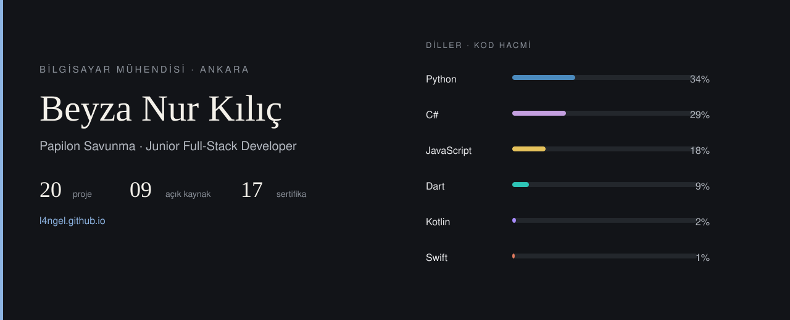

Bilgisayar mühendisiyim. Papilon Savunma'da junior full-stack developer olarak çalışıyorum. Bilgisayarlı görü, yapay zekâ ve savunma sistemleri için uçtan uca yazılım yazıyorum: modelin eğitiminden sahada çalışan uygulamaya kadar.

*I build software for computer vision, machine learning, and defense systems, from training a model through to the application that runs with it.*

## Seçili işler

<table>
  <tr>
    <td width="52" valign="top"><b>01</b></td>
    <td><a href="https://github.com/l4NGEL/AvioHMI"><b>AvioHMI</b></a> Canlı ADS-B verisiyle çalışan görev bilgisayarı, kokpit ekranı ve yer kontrol paneli.</td>
  </tr>
  <tr>
    <td valign="top"><b>02</b></td>
    <td><a href="https://github.com/l4NGEL/stereo-3d-mot"><b>Stereo 3D MOT</b></a> C++17 ile sıfırdan stereo derinlik, 3B çoklu hedef takibi ve görsel odometri.</td>
  </tr>
  <tr>
    <td valign="top"><b>03</b></td>
    <td><a href="https://github.com/l4NGEL/GeoCommand"><b>GeoCommand</b></a> Harita üzerinde canlı araç takibi, bölge olayları ve görev atama.</td>
  </tr>
  <tr>
    <td valign="top"><b>04</b></td>
    <td><a href="https://github.com/l4NGEL/VEXYRON"><b>VEXYRON</b></a> Kasıtlı açıklı bir hedefi tarayıp yayına hazır olup olmadığına karar veren güvenlik aracı.</td>
  </tr>
  <tr>
    <td valign="top"><b>05</b></td>
    <td><a href="https://github.com/l4NGEL/SyncLedger"><b>SyncLedger</b></a> Çevrimdışı çalışan gelir-gider uygulaması; cihazlar arası senkron ve çakışma çözümü.</td>
  </tr>
</table>

Tüm çalışmalar: [l4ngel.github.io](https://l4ngel.github.io/)

[byznrklc01@gmail.com](mailto:byznrklc01@gmail.com) · [LinkedIn](https://www.linkedin.com/in/beyza-nur-kili%C3%A7/)
